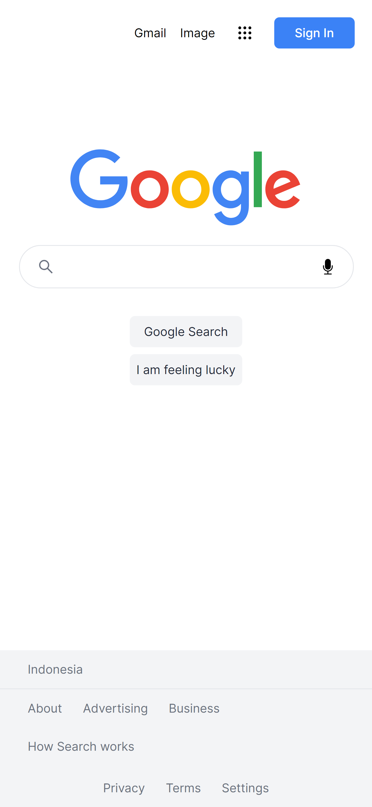
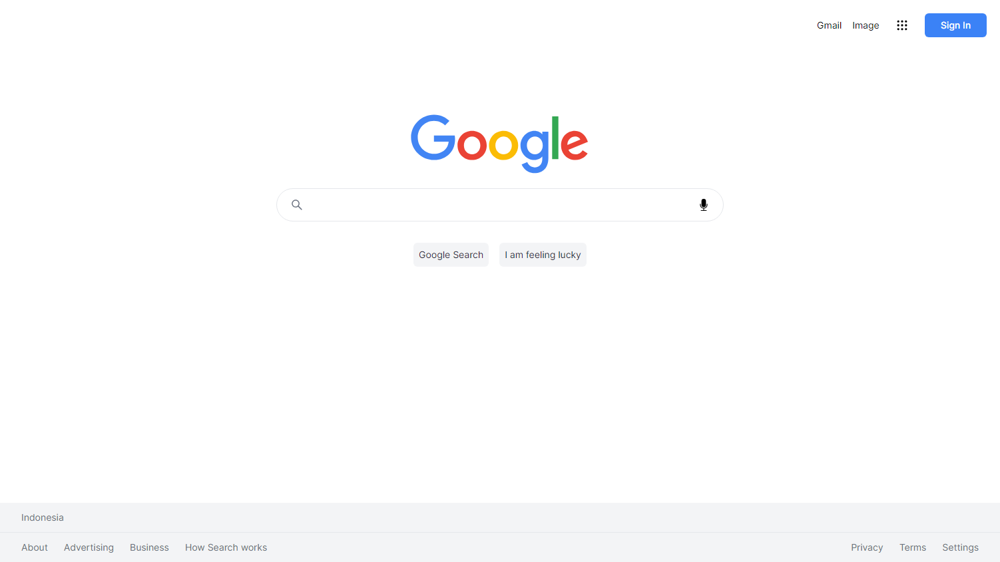

# Google Clone with NextJs

This project is a simple Google clone, built with NextJs and Google Programmable Search Engine API.

## Table of contents

- [Overview](#overview)
  - [The project](#the-project)
  - [Screenshot](#screenshot)
  - [Links](#links)
- [My process](#my-process)
  - [Built with](#built-with)
  - [What I learned](#what-i-learned)
  - [Useful resources](#useful-resources)

## Overview

### The project

App features:

- Search web pages
- Search images
- See a loading placeholder when fetching the data
- See a try again button when fetching error

### Screenshot

#### Mobile Preview

#### Desktop preview

### Links

- [Github repo](https://github.com/nurmarief/google-clone-nextjs/)
- [Live site](https://google-clone-nextjs-blush.vercel.app/)

## My process

### Built with

- NextJs 14
- Tailwindcss
- Google Programmable Search Engine API

### What I Learned

- Nextjs pagination: page layout
- NextJs navigation: useSearchParams, useRouter, usePathname
- React useful 3rd party package: html-react-parser

### Useful resources

- [Random word API](https://random-word-api.herokuapp.com/home)